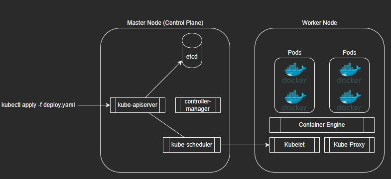
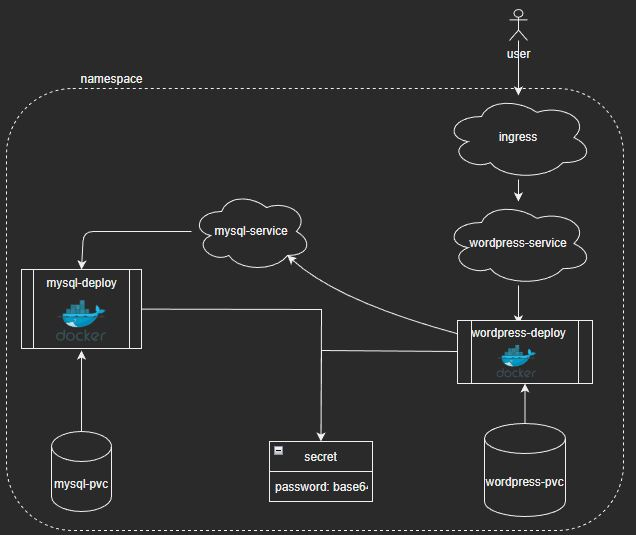

# treinamento-k8s

O treinamento consiste na instalação de um ambiente de wordpress no kubernetes. É possível compreender alguns conceitos básicos do kubernetes ao criar esse ambiente, como os abaixo:

- Deployments e suas conexões com secrets e serviços.
- Funcionalidade básica dos serviços de clusterIP e Ingress.
- Funcionalidades de persistência, utilizando uma claim e montando o volume através do deployment.

*Ps.: As configurações de desse repositório são didáticas, não indicam melhores práticas ou algo do tipo.*

Baseado no exemplo: https://kubernetes.io/docs/tutorials/stateful-application/mysql-wordpress-persistent-volume/

## Dicas:

- Baixar a extensao do Kubernetes da Microsoft para o VS Code.
- Baixar o kubectl: https://kubernetes.io/docs/tasks/tools/install-kubectl-windows/

## Arquitetura do Kubernetes

## Arquitetura do Wordpress

